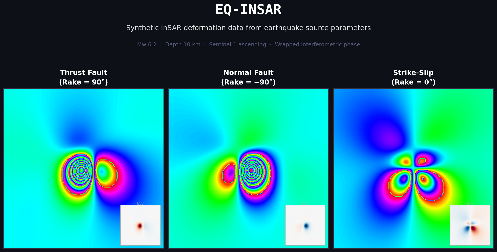
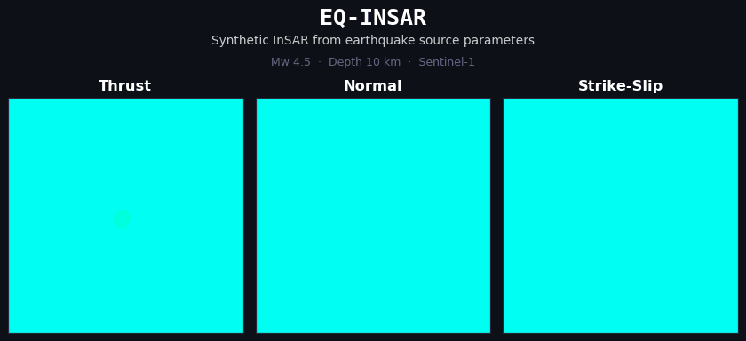

# EQ-INSAR

**Generate synthetic earthquake InSAR data in minutes.**
Physics-based. ML-ready. Reproducible.





[](https://www.python.org/downloads/)
[](https://opensource.org/licenses/MIT)
[](https://doi.org/10.5281/zenodo.18647190)
[](https://pypi.org/project/eq-insar/)
[](https://doi.org/10.31223/X5T19M)

---

## Quick Start

```bash
pip install eq-insar[viz]
```

```python
from eq_insar import generate_synthetic_insar, plot_insar_products

# Mw 6.0 thrust earthquake — Sentinel-1 ascending
result = generate_synthetic_insar(
    Mw=6.0, strike_deg=45, dip_deg=30, rake_deg=90,
    depth_km=10, satellite='sentinel1'
)

plot_insar_products(result)  # wrapped phase, unwrapped, LOS
```

[](https://colab.research.google.com/github/kcieslik/eq-insar/blob/main/examples/showcase.ipynb)

---

## Why EQ-INSAR?

- **ML training data on demand** — generate thousands of labelled interferograms with one function call
- **Physics-based, not hand-crafted** — elastic half-space forward model, not fake blobs
- **Any fault geometry** — thrust, normal, strike-slip, oblique; full strike/dip/rake control
- **9 real satellites built-in** — Sentinel-1, ALOS-2, TerraSAR-X, COSMO-SkyMed, NISAR, and more
- **InSAR-native outputs** — wrapped phase, unwrapped phase, LOS displacement, segmentation masks
- **Realistic noise** — spatially correlated power-law atmospheric noise (Kolmogorov β=5/3) by default, switchable to Gaussian
- **Reproducible** — every call accepts a `seed` for exact dataset reproduction
- **Minimal footprint** — NumPy only for core computation; matplotlib/rasterio/netCDF4 are optional

---

## Where does this fit?

| If you want to... | Use... |
|-------------------|--------|
| Analyze real InSAR time series | MintPy, StaMPS |
| Process raw SAR data | ISCE, PyGMTSAR |
| **Generate synthetic training data** | **eq-insar** |

---

## Example Notebooks

| Notebook | Description | Launch |
|----------|-------------|--------|
| [showcase.ipynb](examples/showcase.ipynb) | Full tutorial — single interferogram to batch ML pipeline | [](https://colab.research.google.com/github/kcieslik/eq-insar/blob/main/examples/showcase.ipynb) |
| [satellite_comparison.ipynb](examples/satellite_comparison.ipynb) | C-band vs L-band vs X-band — wavelength effects on fringe density | [](https://colab.research.google.com/github/kcieslik/eq-insar/blob/main/examples/satellite_comparison.ipynb) |
| [interactive_explorer.ipynb](examples/interactive_explorer.ipynb) | **Interactive ipywidgets explorer** — real-time sliders for strike, dip, rake, depth, and Mw | [](https://colab.research.google.com/github/kcieslik/eq-insar/blob/main/examples/interactive_explorer.ipynb) |
| [earthquake_deformation_segmentation_unet.ipynb](examples/earthquake_deformation_segmentation_unet.ipynb) | **U-Net segmentation quickstart** — generate synthetic data, train, predict in ~3 min on Colab T4 (test IoU 0.773) | [](https://colab.research.google.com/github/kcieslik/eq-insar/blob/main/examples/earthquake_deformation_segmentation_unet.ipynb) |
| [noise_models_comparison.ipynb](examples/noise_models_comparison.ipynb) | **Noise model showcase** — Gaussian vs. correlated power-law noise: visual comparison, PSD, effect of β, interferogram gallery | [](https://colab.research.google.com/github/kcieslik/eq-insar/blob/main/examples/noise_models_comparison.ipynb) |

---


## Installation

```bash
pip install eq-insar          # core (NumPy only)
pip install eq-insar[viz]     # + matplotlib
pip install eq-insar[all]     # + matplotlib, rasterio, netCDF4
```

Requirements: Python 3.8+, NumPy >= 1.20.

For development: `pip install -e ".[dev]"` after cloning.

---

## More Usage Examples

### Generate Time Series for ML Training

```python
from eq_insar import generate_timeseries

result = generate_timeseries(
    Mw=6.0,
    satellite='sentinel1',
    n_pre=5,      # pre-event frames (noise only)
    n_event=1,    # event frames (signal + noise)
    n_post=5      # post-event frames (noise only)
)

X = result['timeseries']  # (11, height, width)
y = result['labels']      # binary segmentation masks (3 mm LOS threshold)
```

### Realistic Atmospheric Noise

```python
from eq_insar import generate_synthetic_insar, generate_correlated_noise

# Correlated noise is the default (Kolmogorov β=5/3)
result = generate_synthetic_insar(Mw=6.0, satellite='sentinel1')

# Switch to uncorrelated Gaussian if needed
result = generate_synthetic_insar(Mw=6.0, satellite='sentinel1',
                                  noise_model='gaussian')

# Generate noise fields directly
noise = generate_correlated_noise((256, 256), amplitude_m=0.005, beta=5/3)
```

### Batch Generation for ML Pipelines

```python
from eq_insar import generate_training_batch, batch_to_arrays

batch = generate_training_batch(
    n_samples=1000,
    mw_range=(5.0, 7.0),
    satellite='sentinel1',
    seed=42
)

result = batch_to_arrays(batch)
X = result['X']  # (1000, T, H, W) — input time series
y = result['y']  # (1000, T, H, W) — segmentation labels
```

### Custom Earthquake Parameters

```python
from eq_insar import sample_earthquake_parameters, generate_synthetic_insar

params = sample_earthquake_parameters(
    mw_range=(5.5, 6.5),
    depth_range_km=(5, 20),
    seed=42
)

result = generate_synthetic_insar(**params, satellite='sentinel1')
```

---

## API Reference

| Function | Description |
|----------|-------------|
| `generate_synthetic_insar()` | Generate a single interferogram |
| `generate_timeseries()` | Generate time series with pre/co/post-event frames |
| `generate_training_batch()` | Generate multiple samples with random parameters |
| `sample_earthquake_parameters()` | Sample random earthquake parameters |
| `batch_to_arrays()` | Convert batch to stacked NumPy arrays |
| `generate_correlated_noise()` | Generate spatially correlated power-law noise field |

Full API reference (all physics, InSAR, I/O, and visualization functions) → **[Documentation](https://kcieslik.github.io/eq-insar/)**

---

## Supported Satellites

| Satellite | Band | Wavelength | Default Incidence | Agency |
|-----------|------|------------|-------------------|--------|
| Sentinel-1 | C | 5.5 cm | 33° | ESA |
| ALOS-2 | L | 22.9 cm | 35° | JAXA |
| TerraSAR-X | X | 3.1 cm | 35° | DLR |
| COSMO-SkyMed | X | 3.1 cm | 35° | ASI |
| RADARSAT-2 | C | 5.5 cm | 35° | CSA |
| NISAR | L | 23.8 cm | 35° | NASA/ISRO |
| SAOCOM | L | 23.5 cm | 35° | CONAE |
| ENVISAT | C | 5.6 cm | 23° | ESA |
| ICEYE | X | 3.1 cm | 30° | ICEYE |

```python
from eq_insar import list_satellites, get_satellite

print(list_satellites())
sentinel1 = get_satellite('sentinel1')
print(f"Wavelength: {sentinel1.wavelength_m * 100:.2f} cm")
```

---

## Fault Geometry Convention

Uses Aki & Richards (2002) convention:

| Parameter | Range | Description |
|-----------|-------|-------------|
| Strike | 0–360° | Clockwise from North |
| Dip | 0–90° | From horizontal |
| Rake | −180 to 180° | Slip direction |

**Rake angle meanings:**
- 0°: Left-lateral strike-slip
- 90°: Thrust/reverse
- ±180°: Right-lateral strike-slip
- −90°: Normal fault

---

## Export Data

### GeoTIFF (requires rasterio)

```python
from eq_insar import generate_synthetic_insar, save_displacement_geotiff

result = generate_synthetic_insar(Mw=6.0, satellite='sentinel1')
save_displacement_geotiff(result, 'output/', prefix='eq_mw60')
# Creates: eq_mw60_east.tif, eq_mw60_north.tif, eq_mw60_up.tif, eq_mw60_los.tif
```

### NetCDF

```python
from eq_insar import save_netcdf, save_timeseries_netcdf, load_netcdf

result = generate_synthetic_insar(Mw=6.0, satellite='sentinel1')
save_netcdf(result, 'output/interferogram.nc')

result_ts = generate_timeseries(Mw=6.0, satellite='sentinel1')
save_timeseries_netcdf(result_ts, 'output/timeseries.nc')

data = load_netcdf('output/interferogram.nc')
```

---

## Development

```bash
pip install -e ".[dev]"
pytest tests/
pytest tests/ --cov=eq_insar --cov-report=html
```

### Package Structure

```
src/eq_insar/
├── core/           # Seismic physics (Davis 1986, moment tensor, magnitude)
├── generators/     # single.py · timeseries.py · batch.py
├── insar/          # LOS projection, phase conversion, noise
├── io/             # GeoTIFF and NetCDF export
└── visualization/  # Plotting functions
```

### Contributing

1. Fork the repository
2. Create a feature branch (`git checkout -b feature/new-feature`)
3. Make your changes and run tests (`pytest tests/`)
4. Open a Pull Request

## Roadmap & Voting

See [ROADMAP.md](ROADMAP.md) for planned features. Browse [open issues sorted by votes](https://github.com/kcieslik/eq-insar/issues?q=is%3Aissue+is%3Aopen+sort%3Areactions-%2B1-desc) and upvote what you'd like to see next.

---

## Physics References

- **Davis, P.M. (1986)**. Surface deformation due to a dipping hydrofracture. *Journal of Geophysical Research*
- **Aki, K. & Richards, P.G. (2002)**. *Quantitative Seismology*, 2nd ed. University Science Books
- **Hanks, T.C. & Kanamori, H. (1979)**. A moment magnitude scale. *Journal of Geophysical Research*
- **Hanssen, R.F. (2001)**. *Radar Interferometry: Data Interpretation and Error Analysis*. Springer
- **Wells, D.L. & Coppersmith, K.J. (1994)**. New empirical relationships among magnitude, rupture length, rupture width, rupture area, and surface displacement. *BSSA*

## Citation

If you use EQ-INSAR in your research, please cite:

**Preprint:**

```bibtex
@article{cieslik2026eqinsar_preprint,
  author = {Cieslik, Konrad and Milczarek, Wojciech},
  title = {EQ-INSAR: A Python Package for Generating Synthetic Earthquake InSAR Deformation Data},
  year = {2026},
  publisher = {EarthArXiv},
  doi = {10.31223/X5T19M},
  url = {https://eartharxiv.org/repository/view/11910/}
}
```

**Software:**

```bibtex
@software{cieslik2026eqinsar,
  author = {Cieslik, Konrad and Milczarek, Wojciech},
  title = {EQ-INSAR: A Python Package for Generating Synthetic Earthquake InSAR Deformation Data},
  year = {2026},
  url = {https://github.com/kcieslik/eq-insar},
  doi = {10.5281/zenodo.18647190}
}
```

## License

MIT License — see [LICENSE](LICENSE) file for details.

## Acknowledgments

Developed at the Wroclaw University of Science and Technology & trainai.io
